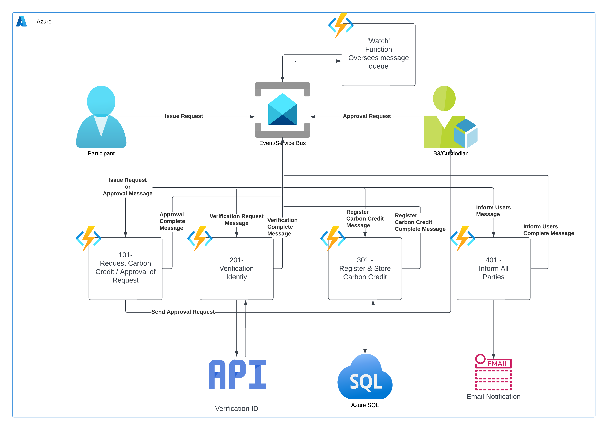

# Durable Functions Investigation

## Overview

This document covers the investigation into using Azure Durable Functions to implement B3 workflows. It details possible implementation patterns, workflow authoring options, function capabilities, and monitoring solutions.

## What is a Durable Function

Durable Functions is an extension of Azure Functions. You can use Durable Functions for stateful orchestration of function execution. A durable function app is a solution that's made up of different Azure functions. Functions can play different roles in a durable function orchestration.

There are currently four durable function types in Azure Functions: activity, orchestrator, entity, and client.

More about Durable Functions can be found in [this article](https://learn.microsoft.com/en-us/azure/azure-functions/durable/durable-functions-overview?tabs=java)

## Patterns

### Function chaining

In the function chaining pattern, a sequence of functions executes in a specific order. In this pattern, the output of one function is applied to the input of another function. The use of queues between each function ensures that the system stays durable and scalable, even though there is a flow of control from one function to the next.

We can use Durable Functions to implement the function chaining pattern, implementing control flow by using normal imperative coding constructs. Code executes from the top down. The code can involve existing language control flow semantics, like conditionals and loops. You can include error-handling logic in try/catch/finally blocks.

A diagram of the B3 workflow using the function chaining pattern

In this example workflow, after a participant makes the request, the approval step of the 101 task can be implemented using Durable Timer sub-activities.

Durable Functions provides durable timers for use in orchestrator functions to implement delays or to set up timeouts on async actions. [More about timers](https://learn.microsoft.com/en-us/azure/azure-functions/durable/durable-functions-timers?tabs=java) and [example of delay implementation](https://learn.microsoft.com/en-us/azure/azure-functions/durable/durable-functions-timers?tabs=java#usage-for-delay)

The following workflow tasks, 201, 301, and 401, can be implemented using activity functions or sub-orchestrations. Sub-orchestrations are a feature of Durable Functions that, simply put, allows you to call an orchestration from within another orchestration. In this way, they are similar to calling activity functions from within an orchestration, and just like activity functions can return a value to the parent orchestration. [More information about Durable Functions](https://learn.microsoft.com/en-us/azure/azure-functions/durable/durable-functions-sub-orchestrations?tabs=java)

### Message Based

## Authoring

While the team was unable to identify a workflow template solution for Durable Functions, the team did identify a possible implementation using [Business Process Model and Notation](https://www.bpmn.org/) (BPMN) to define workflows. The BPMN notation could be developed in various diagram tools such as [BPMN.io](https://bpmn.io/), and then could be parsed (from exported XML) to generic templated functions.

This solution has yet to be implemented and would need more investigation before it should be considered viable.

## Capabilities

Some key capabilities of Azure Durable Functions that pertain to the problem solution, are:

### Various Function Types

- __Orchestrator functions__:
Orchestrator functions describe how actions are executed and the order in which actions are executed.

- __Activity functions__:
Activity functions are the basic unit of work in a durable function orchestration. Activity functions are the functions and tasks that are orchestrated in the process.

- __Entity functions__:
Entity functions define operations for reading and updating small pieces of state.

- __Client functions__:
Orchestrator functions are triggered by an orchestration trigger binding and entity functions are triggered by an entity trigger binding. Both of these triggers work by reacting to messages that are enqueued into a task hub.

### Sub-orchestrations

Orchestrator functions can call activity functions, but also other orchestrator functions. For example, you can build a larger orchestration out of a library of orchestrator functions. Or, you can run multiple instances of an orchestrator function in parallel.

For more information and for examples, see the Sub-orchestrations article.

### Durable timers

Orchestrations can schedule durable timers to implement delays or to set up timeout handling on async actions. Use durable timers in orchestrator functions instead of language-native "sleep" APIs.

For more information and for examples, see the Durable timers article.

### External events

Orchestrator functions can wait for external events to update an orchestration instance. This Durable Functions feature often is useful for handling a human interaction or other external callbacks.

For more information and for examples, see the External events article.

### Error handling

Orchestrator functions can use the error-handling features of the programming language. Existing patterns like try/catch are supported in orchestration code.

## Monitoring

Points of comparison

1. Ability for multiple teams to leverage state machine and build code
2. Templates for other teams to build on top of
3. Workflow definition
4. Failures and retries
5. State store for application
6. Observability for the application
